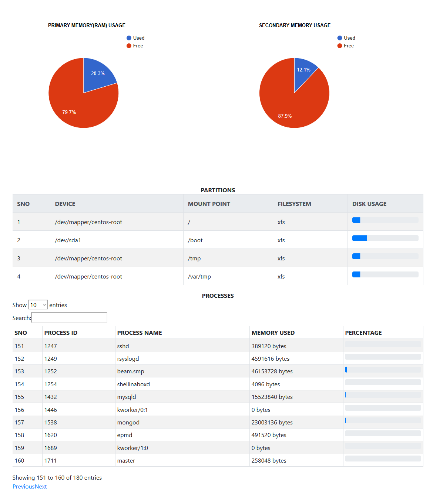

# ServerBee

All our linux machines are purely powered by Python which currently does not have a proper infrasture monitioring tools unlike
PHP. It is a time consuming process to monitor the infrastructure of servers by logging into them via SSH, we needed a quick
solution to solve our immediate needs like checking the memory consumptions, processes running and their usage etc., So we have
programmed a small webpage which tells these details. This will be running seperately along with other websites hosted in the
server.

